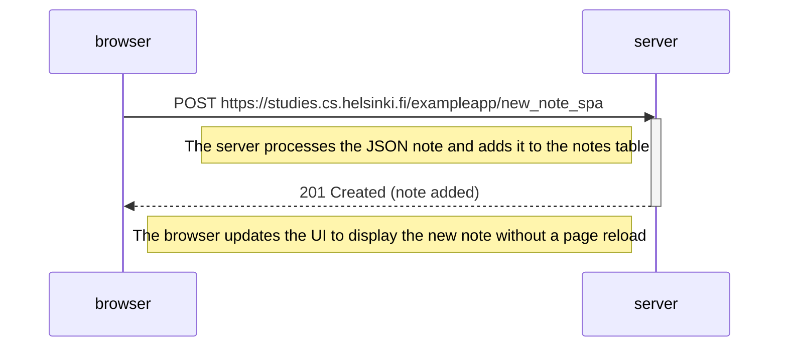

```mermaid
sequenceDiagram
    participant browser
    participant server

    browser->>server: POST https://studies.cs.helsinki.fi/exampleapp/new_note_spa
    activate server
    Note left of server: The server processes the JSON note and adds it to the notes table
    server-->>browser: 201 Created (note added)
    deactivate server
    Note right of browser: The browser updates the UI to display the new note without a page reload
```
